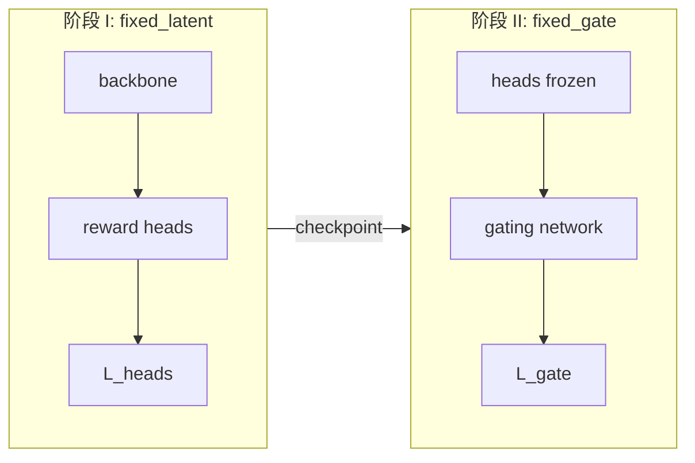

# 无 Selector 两阶段训练：损失函数设计

> 对应脚本：`run_train_two_stage_fixed_prefix.sh`  
> 实现：`utils/loss_functions.py` → `compute_fixed_prefix_loss`；`scripts/train_rm.py` → `train_stage ∈ {fixed_latent, fixed_gate}`

---

## 1. 符号与设定

| 符号 | 含义 |
|------|------|
| \(B\) | batch 大小 |
| \(K\) | reward head 总数（`k_dimensions`） |
| \(K_{+}\) | 正向维个数（`num_pos_heads`，**固定前缀**） |
| \(b \in \{1,\ldots,B\}\) | 样本索引 |
| \(k \in \{0,\ldots,K-1\}\) | head / 维度索引 |
| \(z_{c,b,k},\, z_{r,b,k}\) | chosen / rejected 在第 \(k\) 维的标量分数 |
| \(\sigma(\cdot)\) | logistic 函数，\(\sigma(x) = 1/(1+e^{-x})\) |
| \(\lambda_{\mathrm{neg}}\) | 负向维 BT 项权重（默认 \(1\)） |
| \(\lambda_{\mathrm{gate}}\) | 阶段二 gate 损失权重（默认 \(1\)） |
| \(T\) | gate 温度（`gate_temperature`，默认 \(10\)） |

**无 selector**：不使用 \(p^{+}_{b,k}\)、top-\(k\) 或 \(\mathcal{L}_{\mathrm{selector}}\)。

**固定前缀掩码**（与样本无关，由索引决定）：

$$
m^{+}_{b,k} = \mathbb{1}[k < K_{+}], \qquad
m^{-}_{b,k} = 1 - m^{+}_{b,k} = \mathbb{1}[k \ge K_{+}]
$$

其中 \(\mathbb{1}[\cdot]\) 为示性函数。例如 \(K=10,\, K_{+}=6\) 时，\(k=0,\ldots,5\) 为 \(K_{+}\)，\(k=6,\ldots,9\) 为 \(K_{-}\)。

**分差**：

$$
\Delta_{b,k} = z_{c,b,k} - z_{r,b,k}
$$

---

## 2. 逐维 Bradley–Terry 项

正向维（chosen 应更高）：

$$
\ell^{+}_{b,k} = -\log \sigma(\Delta_{b,k})
$$

负向维（rejected 应更高）：

$$
\ell^{-}_{b,k} = -\log \sigma(-\Delta_{b,k}) = -\log \sigma(z_{r,b,k} - z_{c,b,k})
$$

---

## 3. 多维偏好损失 \(\mathcal{L}_{\mathrm{heads}}\)

对单个样本 \(b\)，在 \(K\) 维上加权求和：

$$
\mathcal{L}_{\mathrm{heads}}^{(b)} = \sum_{k=0}^{K-1} \left(
    m^{+}_{b,k}\, \ell^{+}_{b,k}
    + \lambda_{\mathrm{neg}}\, m^{-}_{b,k}\, \ell^{-}_{b,k}
\right)
$$

batch 平均：

$$
\mathcal{L}_{\mathrm{heads}}
= \frac{1}{B} \sum_{b=1}^{B} \mathcal{L}_{\mathrm{heads}}^{(b)}
$$

**代码对应**（`compute_fixed_prefix_loss`）：

$$
\mathcal{L}_{\mathrm{heads}} = \mathbb{E}_{b}\left[
    \sum_{k} \left( m^{+}_{b,k} \odot \ell^{+}_{b,k}
    + \lambda_{\mathrm{neg}}\, m^{-}_{b,k} \odot \ell^{-}_{b,k} \right)
\right]
$$

（\(\odot\) 为逐元素乘。）

---

## 4. Gate 标量与 \(\mathcal{L}_{\mathrm{gate}}\)

### 4.1 Gate 权重

对 chosen / rejected 分别用最后一层隐状态 \(h_{c,b},\, h_{r,b}\) 经 gating network 得到非负权重（softmax）：

$$
\mathbf{w}_{c,b} = \mathrm{softmax}\!\left(\frac{g(h_{c,b})}{T}\right) \in \mathbb{R}^{K},
\qquad
\mathbf{w}_{r,b} = \mathrm{softmax}\!\left(\frac{g(h_{r,b})}{T}\right)
$$

其中 \(g(\cdot)\) 为 MLP 输出的 \(K\) 维 logits，\(\sum_{k} w_{c,b,k} = 1\)。

### 4.2 Gated 标量 reward

$$
g_{c,b} = \sum_{k=0}^{K-1} w_{c,b,k}\, z_{c,b,k},
\qquad
g_{r,b} = \sum_{k=0}^{K-1} w_{r,b,k}\, z_{r,b,k}
$$

### 4.3 标量 Bradley–Terry 损失

$$
\mathcal{L}_{\mathrm{gate}}
= \frac{1}{B} \sum_{b=1}^{B}
\left( -\log \sigma(g_{c,b} - g_{r,b}) \right)
$$

---

## 5. 阶段一：`fixed_latent`

**训练模块**：backbone + \(\{ \text{reward head}_k \}_{k=0}^{K-1}\)  
**不训练**：gating network（未启用或 \(\lambda_{\mathrm{gate}}=0\)）

**总损失**：

$$
\boxed{
\mathcal{L}^{(\mathrm{I})}_{\mathrm{total}} = \mathcal{L}_{\mathrm{heads}}
}
$$

超参（`_loss_lambdas`）：\(\lambda_{\mathrm{latent}} = 1,\; \lambda_{\mathrm{gate}} = 0\)。

**可训练参数**：\(\theta_{\mathrm{bb}}\)（backbone）、\(\theta_{\mathrm{head}}\)（各维 MLP head）。

---

## 6. 阶段二：`fixed_gate`

**前置**：从阶段一 checkpoint resume（`--resume_from .../best`）。

**训练模块**：仅 gating network 参数 \(\theta_{\mathrm{gate}}\)。

**冻结**：backbone、所有 reward head；前向中对 head 分数 **stop-gradient**：

$$
\tilde{z}_{c,b,k} = \mathrm{sg}(z_{c,b,k}), \qquad
\tilde{z}_{r,b,k} = \mathrm{sg}(z_{r,b,k})
$$

其中 \(\mathrm{sg}(\cdot)\) 为 detach。Gate 聚合使用 \(\tilde{z}\)：

$$
g_{c,b} = \sum_{k} w_{c,b,k}\, \tilde{z}_{c,b,k}, \qquad
g_{r,b} = \sum_{k} w_{r,b,k}\, \tilde{z}_{r,b,k}
$$

**总损失**（不计算 \(\mathcal{L}_{\mathrm{heads}}\)）：

$$
\boxed{
\mathcal{L}^{(\mathrm{II})}_{\mathrm{total}}
= \lambda_{\mathrm{gate}}\, \mathcal{L}_{\mathrm{gate}}
}
$$

超参：\(\lambda_{\mathrm{latent}} = 0,\; \lambda_{\mathrm{gate}} = 1\)（默认）。

**说明**：阶段二 gate 仅学习「如何加权已训好的各维分数」，不再更新 \(\Delta_{b,k}\) 的来源。

---

## 7. 两阶段总览

| 阶段 | `train_stage` | \(\mathcal{L}_{\mathrm{total}}\) | 可训练 |
|------|---------------|-----------------------------------|--------|
| I | `fixed_latent` | \(\mathcal{L}_{\mathrm{heads}}\) | backbone, heads |
| II | `fixed_gate` | \(\lambda_{\mathrm{gate}} \mathcal{L}_{\mathrm{gate}}\) | gate only |

统一写法（实现中的组合形式）：

$$
\mathcal{L}_{\mathrm{total}}
= \lambda_{\mathrm{latent}}\, \mathcal{L}_{\mathrm{heads}}
+ \lambda_{\mathrm{gate}}\, \mathcal{L}_{\mathrm{gate}}
$$

| 阶段 | \(\lambda_{\mathrm{latent}}\) | \(\lambda_{\mathrm{gate}}\) |
|------|------------------------------|------------------------------|
| I | \(1\) | \(0\) |
| II | \(0\) | \(\lambda_{\mathrm{gate}}\)（默认 \(1\)） |

阶段一未传入 \(g_{c,b}, g_{r,b}\) 时，\(\mathcal{L}_{\mathrm{gate}}\) 项为零。

---

## 8. 验证指标（非损失，仅监控）

### 8.1 阶段一（无 gate）

**全局 pairwise 准确率** \(\mathrm{Acc}^{(\mathrm{I})}\)（用于选 `best` checkpoint）：**全 \(K\) 维求和**，含 \(K_{-}\)：

$$
R_{c,b} = \sum_{k=0}^{K-1} z_{c,b,k}, \qquad
R_{r,b} = \sum_{k=0}^{K-1} z_{r,b,k}
$$

$$
\mathrm{Acc}^{(\mathrm{I})}
= \frac{1}{B} \sum_{b=1}^{B} \mathbb{1}[R_{c,b} > R_{r,b}]
$$

**辅助指标**（仅 \(K_{+}\) 前缀求和，与训练掩码一致，**不**用于阶段一 `best`）：

$$
R^{(+)}_{c,b} = \sum_{k=0}^{K-1} m^{+}_{b,k}\, z_{c,b,k}
$$

### 8.2 阶段二（有 gate）

$$
\mathrm{Acc}^{(\mathrm{II})}
= \frac{1}{B} \sum_{b=1}^{B} \mathbb{1}[g_{c,b} > g_{r,b}]
$$

评测导出 `score_mode = gated_scalar` 时，推理标量即为 \(g_{c,b}\)（单序列输入）。

---

## 9. 与有 selector 原两阶段的区别

| 项目 | 原 `latent` → `gate` | 本方案 `fixed_latent` → `fixed_gate` |
|------|----------------------|--------------------------------------|
| \(K_{+}\) 定义 | \(\mathrm{top}\text{-}K_{+}(p^{+})\) | 固定 \(k < K_{+}\) |
| \(\mathcal{L}_{\mathrm{selector}}\) | 有 | **无** |
| 阶段一 \(\mathcal{L}_{\mathrm{total}}\) | \(\mathcal{L}_{\mathrm{heads}} + \mathcal{L}_{\mathrm{selector}}\) | \(\mathcal{L}_{\mathrm{heads}}\) |
| 阶段二 | \(\lambda_{\mathrm{gate}} \mathcal{L}_{\mathrm{gate}}\)，\(z\) detach | 同左 |

---

## 10. 默认超参（脚本）

`run_train_two_stage_fixed_prefix.sh` 典型默认：

- \(K = 10\)，\(K_{+} = 6\)
- \(\lambda_{\mathrm{neg}} = 1\)
- \(\lambda_{\mathrm{gate}} = 1\)
- 阶段一：`head_lr`, `backbone_lr`；阶段二：`gate_lr`

实验目录示例：

- 阶段 I：`..._k10_prefix6_fixed_2stage_latent`
- 阶段 II：`..._k10_prefix6_fixed_2stage_latent_gate`

---

## 11. 实现索引

| 内容 | 路径 |
|------|------|
| 掩码与损失 | `utils/loss_functions.py`：`fixed_prefix_masks`, `compute_fixed_prefix_loss` |
| 阶段开关 | `scripts/train_rm.py`：`_loss_lambdas`, `_configure_requires_grad`, `detach_scores_for_gate` |
| 两阶段启动 | `run_train_two_stage_fixed_prefix.sh` |

---

## 12. 版本

| 日期 | 说明 |
|------|------|
| 2026-05-28 | 初版：无 selector 固定前缀两阶段损失（LaTeX） |
