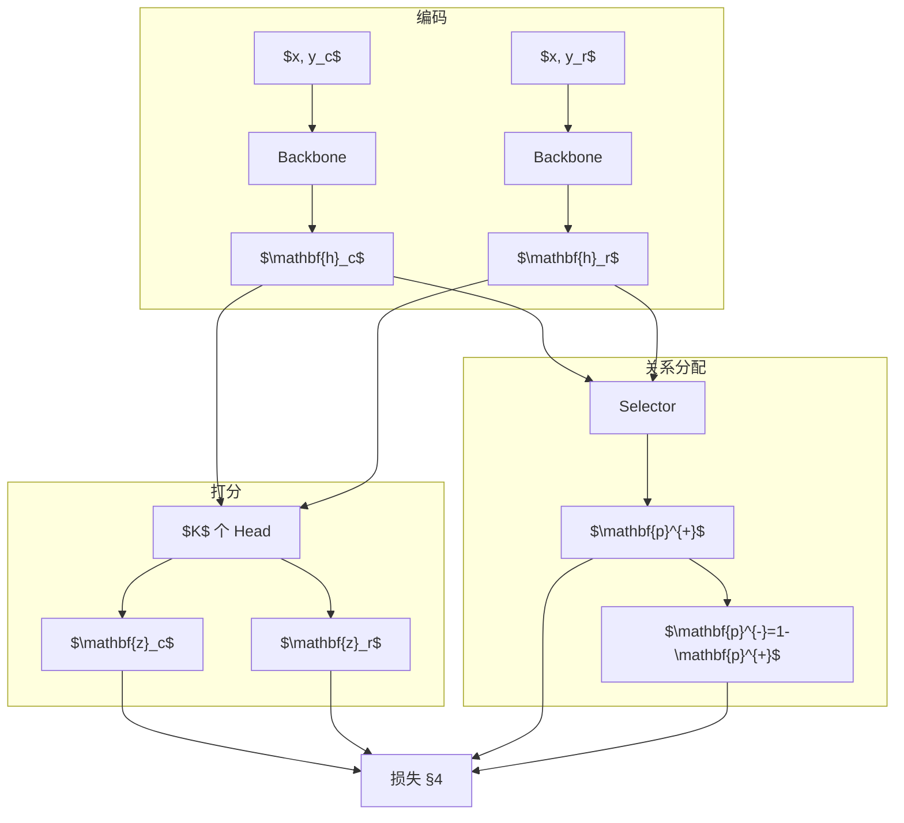
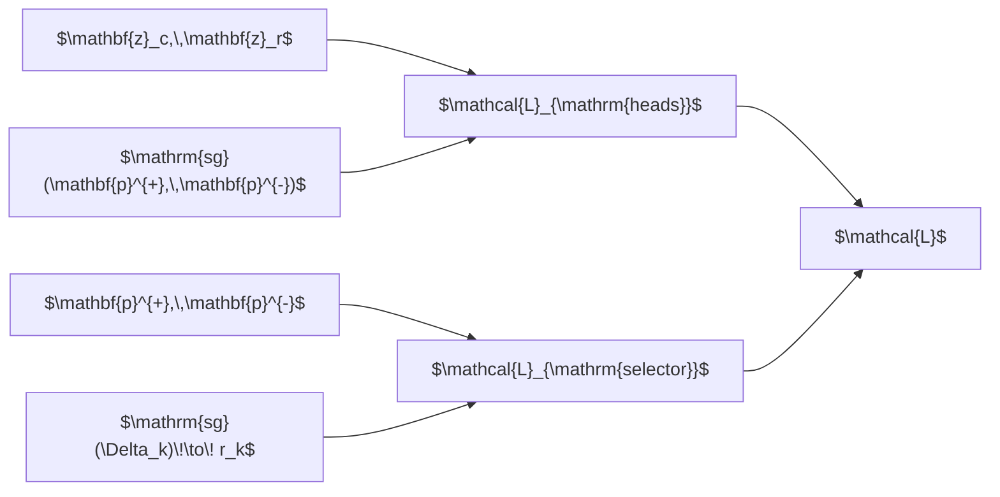

# Latent Reward Model：结构与损失设计

本文档说明 **Latent Reward Model（Latent MRM）** 的模型结构与损失函数设计。实现见 `models/latent_reward_model.py`、`utils/loss_functions.py`。

---

## 1. 问题设定与符号

给定一条偏好样本：提示 $x$，优选回复 $y_c$（chosen），劣选回复 $y_r$（rejected）。经分词与 chat template 编码后得到两条序列，模型分别编码为句向量 $\mathbf{h}_c, \mathbf{h}_r \in \mathbb{R}^{H}$。

| 符号 | 含义 |
|------|------|
| $K$ | 潜在评价维度数（`k_dimensions`） |
| $H$ | backbone 隐藏维（如 Llama-3-8B 中 $H{=}4096$） |
| $z_{c,k},\, z_{r,k}$ | 第 $k$ 维 head 对 chosen / rejected 的标量打分 |
| $\mathbf{z}_c, \mathbf{z}_r$ | $\mathbb{R}^K$ 上的打分向量 |
| $p_k^{+},\, p_k^{-}$ | Selector 在维度 $k$ 上的正向 / 反向概率，$p_k^{-} = 1 - p_k^{+}$ |
| $K^{+}$ | 训练时选出的正向维度集合（见 §4.2） |
| $K^{-}$ | 其余维度，$K^{-} = \{1,\ldots,K\} \setminus K^{+}$ |

**与单头 RM 的区别**：baseline 学习标量 $r(\mathbf{h}) \in \mathbb{R}$ 及损失 $-\log\sigma(r_c - r_r)$；本模型学习 $K$ 维打分，并由 Selector 为每一维指定「chosen 应更高」或「rejected 应更高」的角色。

---

## 2. 模型结构

### 2.1 总览

模型由三部分组成：**共享 Backbone**、$K$ 个 **Reward Head**、**Selector**。前向对 chosen 与 rejected **各执行一次** Backbone，再共享同一组 Head 与 Selector 参数。

### 2.2 Backbone 与句向量

Backbone 为预训练 Llama 的 `LlamaModel`（实现上可从 CausalLM 或 ArmoRM 包装类中取出 `.model`，**不使用** ArmoRM 原有 gating / score 头）。

对序列 $s \in \{c, r\}$：

$$
\mathbf{X}_s \in \mathbb{R}^{L \times H}
= \mathrm{Backbone}(\mathrm{tokens}(y_s))
$$

**Last-token pooling**（left padding 下取最后一个有效 token）：

$$
\mathbf{h}_s = \mathbf{X}_s\big[\,t_{\mathrm{last}}(s),\, : \,\big] \in \mathbb{R}^{H}
$$

### 2.3 Reward Head（$K$ 维潜在打分）

每个维度 $k \in \{1,\ldots,K\}$ 对应独立 MLP $f_k$（参数不共享）：

$$
f_k(\mathbf{h}) =
W^{(2)}_k \,\mathrm{ReLU}\!\big(W^{(1)}_k \mathbf{h} + \mathbf{b}^{(1)}_k\big)
+ b^{(2)}_k
$$

$$
z_{s,k} = f_k(\mathbf{h}_s), \quad
\mathbf{z}_s = \big[z_{s,1},\ldots,z_{s,K}\big]^\top \in \mathbb{R}^{K},
\quad s \in \{c,r\}
$$

代码中 `scores_c`、`scores_r` 即 $\mathbf{z}_c$、$\mathbf{z}_r$，无输出激活，$z_{s,k} \in \mathbb{R}$。

### 2.4 Selector（维度级关系分配）

将 chosen / rejected 句向量拼接后，经 MLP 与 sigmoid 得到每个维度上的正向概率：

$$
\mathbf{u} = [\mathbf{h}_c;\, \mathbf{h}_r] \in \mathbb{R}^{2H}
$$

$$
\tilde{\mathbf{p}}^{+} = W_2 \,\mathrm{ReLU}(W_1 \mathbf{u} + \mathbf{b}_1) + \mathbf{b}_2 \in \mathbb{R}^{K}
$$

$$
p_k^{+} = \sigma(\tilde{p}_k^{+}) = \frac{1}{1 + e^{-\tilde{p}_k^{+}}},
\qquad
p_k^{-} = 1 - p_k^{+}
$$

**语义**：

- $p_k^{+}$ 大：模型认为第 $k$ 维在本样本上属于 **正向维**，期望 $z_{c,k} > z_{r,k}$；
- $p_k^{-}$ 大：模型认为第 $k$ 维属于 **反向维**，期望 $z_{r,k} > z_{c,k}$。

Selector 输出为**软概率**；训练损失中再通过 top-$K^{+}$ 硬选出一部分维度参与 Head / Selector 的优化（§4.2）。

### 2.5 前向输出汇总

对 batch 中每个样本，模型返回：

$$
\mathbf{z}_c,\; \mathbf{z}_r \in \mathbb{R}^{K},
\qquad
\mathcal{R} = \big[p_k^{+},\; p_k^{-}\big]_{k=1}^{K} \in [0,1]^{K \times 2}
$$

| 量 | 形状 |
|----|------|
| $\mathbf{h}_c,\, \mathbf{h}_r$ | $[B,\, H]$ |
| $\mathbf{z}_c,\, \mathbf{z}_r$ | $[B,\, K]$ |
| $\mathbf{p}^{+},\, \mathbf{p}^{-}$ | $[B,\, K]$ |

---

## 3. 损失函数设计

总目标为在偏好监督下，同时学好 **「各维如何打分」**（Head）与 **「各维扮演何种角色」**（Selector）。总损失为：

$$
\mathcal{L}
= \mathcal{L}_{\mathrm{heads}}
+ \mathcal{L}_{\mathrm{selector}}
$$

（代码中记为 `L_total`。方向性惩罚 $\mathcal{L}_{\mathrm{dir}}$ 已实现但**未接入**总损失。）

### 3.1 维度级 Bradley-Terry 基项

记维度 $k$ 上的分差：

$$
\Delta_k = z_{c,k} - z_{r,k}
$$

标准 logistic 偏好损失（与单头 RM 同形，但按维定义）：

$$
\ell_k^{+} = -\log \sigma(\Delta_k)
= \log\big(1 + e^{-\Delta_k}\big)
$$

$$
\ell_k^{-} = -\log \sigma(-\Delta_k)
= \log\big(1 + e^{\Delta_k}\big)
$$

- $\ell_k^{+}$：若维 $k$ 为正向，应使 chosen 分更高；
- $\ell_k^{-}$：若维 $k$ 为反向，应使 rejected 分更高。

### 3.2 Top-$K^{+}$ 硬分配

设超参 $K^{+} = \texttt{num\_pos\_heads}$（常取 $5$，且 $K^{+} \le K$）。对每个样本，按 $p_k^{+}$ 降序取前 $K^{+}$ 个维度索引构成集合 $\mathcal{I}^{+}$，其余为 $\mathcal{I}^{-}$。定义硬 mask：

$$
m_k^{+} =
\begin{cases}
1, & k \in \mathcal{I}^{+} \\
0, & k \in \mathcal{I}^{-}
\end{cases}
\qquad
m_k^{-} = 1 - m_k^{+}
$$

因此训练时并非对全部 $K$ 维做均匀软加权，而是 **先 top-$K^{+}$ 硬选正向维**，再用 $p_k^{+}, p_k^{-}$ 作软权重。

### 3.3 $\mathcal{L}_{\mathrm{heads}}$：训练 Reward Head

**设计意图**：在已（近似）确定的维度角色下，让 Head 拉大 chosen / rejected 的可分性；**不更新 Selector**（对 $p_k^{+}, p_k^{-}$ 停梯度）。

$$
\mathcal{L}_{\mathrm{heads}}
= \frac{1}{B}\sum_{b=1}^{B} \sum_{k=1}^{K}
\Big(
m_{b,k}^{+}\, \mathrm{sg}(p_{b,k}^{+})\, \ell_{b,k}^{+}
+
m_{b,k}^{-}\, \mathrm{sg}(p_{b,k}^{-})\, \ell_{b,k}^{-}
\Big)
$$

其中 $\mathrm{sg}(\cdot)$ 表示 stop-gradient（代码中 `detach()`）。只有 $\mathbf{z}_c, \mathbf{z}_r$（经 $\Delta_k$）接收梯度。

### 3.4 $\mathcal{L}_{\mathrm{selector}}$：训练 Selector

**设计意图**：在 Head 打分暂时固定时，调整 $p_k^{+}, p_k^{-}$，使关系分配与当前分差一致；**不更新 Head**（对 $\Delta_k$ 停梯度）。

定义有界奖励信号：

$$
r_k = \tanh(\Delta_k) = \tanh(z_{c,k} - z_{r,k}),
\quad
\mathrm{sg}(\Delta_k)\ \text{参与}
$$

对 $K^{+}$ 中维度，若 $r_k > 0$（chosen 更高），应提高 $p_k^{+}$：

$$
\mathcal{L}_{\mathrm{sel}}^{+}
= -\sum_{k=1}^{K} m_k^{+}\, \log\big(p_k^{+} + \varepsilon\big)\, r_k,
\quad \varepsilon = 10^{-8}
$$

对 $K^{-}$ 中维度，若 $r_k < 0$（rejected 更高），应提高 $p_k^{-}$，等价于用 $-r_k$ 加权：

$$
\mathcal{L}_{\mathrm{sel}}^{-}
= -\sum_{k=1}^{K} m_k^{-}\, \log\big(p_k^{-} + \varepsilon\big)\, (-r_k)
$$

$$
\mathcal{L}_{\mathrm{selector}}
= \frac{1}{B}\sum_{b=1}^{B}
\Big( \mathcal{L}_{\mathrm{sel},b}^{+} + \mathcal{L}_{\mathrm{sel},b}^{-} \Big)
$$

该项在形式上等价于以 $\tanh(\Delta_k)$ 为回报的 **REINFORCE / 策略梯度** 式目标：用当前打分差指导概率分配，避免 Head 与 Selector 在同一损失中直接竞争梯度。

### 3.5 双路径梯度解耦

| 路径 | 可训练参数 | 冻结量 |
|------|------------|--------|
| $\mathcal{L}_{\mathrm{heads}}$ | Backbone、$f_k$ | $p_k^{+}, p_k^{-}$ |
| $\mathcal{L}_{\mathrm{selector}}$ | Selector | $z_{c,k}, z_{r,k}$（经 $\Delta_k$） |

### 3.6 未启用的方向性惩罚（供参考）

代码中保留 $\mathcal{L}_{\mathrm{dir}}$ 的多种设计（如约束样本级 $\frac{1}{K}\sum_k p_k^{+} \ge \tau$），由超参 `beta_dir`、`target_tau` 控制，但当前 **未加入** $\mathcal{L}$。若启用，形式为：

$$
\mathcal{L} = \mathcal{L}_{\mathrm{heads}} + \mathcal{L}_{\mathrm{selector}} + \beta_{\mathrm{dir}}\, \mathcal{L}_{\mathrm{dir}}
$$

---

## 4. 结构相关超参

| 超参 | 典型值 | 作用 |
|------|--------|------|
| `k_dimensions` $K$ | 8 | 潜在维数 |
| `num_pos_heads` $K^{+}$ | 5 | 每样本正向维个数（$\le K$） |
| `beta_dir`, `target_tau` | — | 仅用于未启用的 $\mathcal{L}_{\mathrm{dir}}$ |

---

## 5. 推理时的标量聚合（可选）

训练监控中的「全局准确率」将 $K^{+}$ 上分数加权为伪标量 reward：

$$
\hat{r}_c = \sum_{k \in \mathcal{I}^{+}} z_{c,k},
\qquad
\hat{r}_r = \sum_{k \in \mathcal{I}^{+}} z_{r,k}
$$

以 $\hat{r}_c > \hat{r}_r$ 判为该样本偏好预测正确。该聚合**不是**训练主损失的一部分，仅用于 eval 与可解释性。

---

## 6. 代码索引

| 模块 | 文件 |
|------|------|
| `LatentRewardModel` | `models/latent_reward_model.py` |
| `compute_latent_factor_loss` | `utils/loss_functions.py` |
| Pooling | `models/pooling.py` |

---

*文档版本：2026-05-25 · 侧重模型结构与损失设计*
